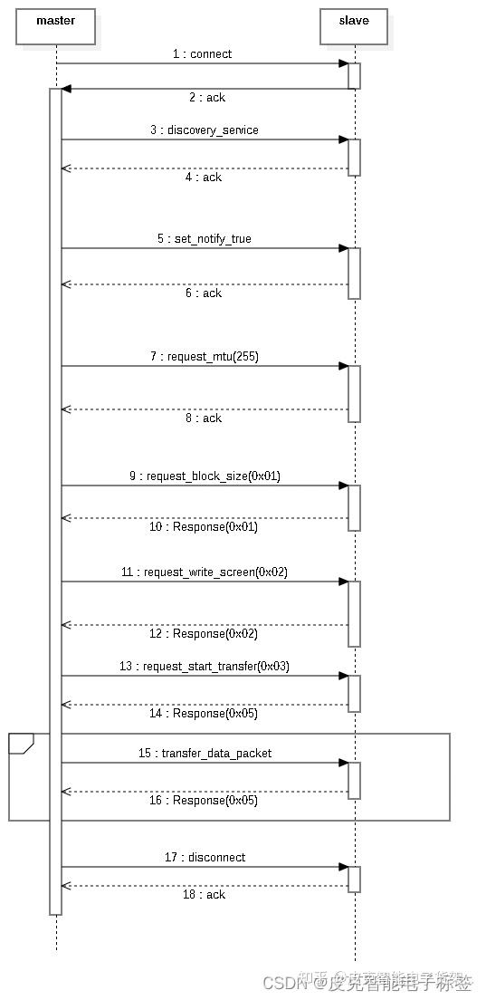

# Bluetooth Tag Protocol

### 1.Request write block size command

| CMD | DATA |
| --- | --- |
| 0x01 | none |

Response for write block size command

| CMD | DATA (short) |
| --- | --- |
| 0x01 | Block size |

Note: short means low bit first, high bit last

### 2.Request write screen command

| CMD | DATA |    |
| --- | --- | --- |
| 0x02 | Image length(int) | Image type (obsolete) |

Note: int has low bits first and high bits last

Response for write screen command

| CMD | DATA (byte) |
| --- | --- |
| 0x02 | Status      0:Success      Other:Fail |

### 3.Request start transfer command

| CMD | DATA |
| --- | --- |
| 0x03 | none |

Response for start transfer command

| CMD | DATA |    |
| --- | --- | --- |
| 0x05 | Previous block status(byte) 0: success      Other: Fail | Request block number(int)      (Request block index) |

Note: int has low bits first and high bits last

### 4.Request write cancel command

| CMD | DATA |
| --- | --- |
| 0x04 | none |

Response for write cancel command

| CMD | DATA (byte) |
| --- | --- |
| 0x04 | Status      0: Success      Other: Fail |

### 5.Transfer data packet

| Index(4 bytes) | DATA(N bytes) |
| --- | --- |
| Packet index (int) | N bytes of data (MAX=240) |

Note: int has low bits first and high bits last

### 6. Bluetooth tag interaction diagram

### 7. Bluetooth Service Characteristic Value UUID

| Service characteristic value |
| --- |
| 0000fef0-0000-1000-8000-00805f9b34fb |

| Notify characteristic value |
| --- |
| 0000fef1-0000-1000-8000-00805f9b34fb |

| Write characteristic value |
| --- |
| 0000fef2-0000-1000-8000-00805f9b34fb |

### 8. Broadcast data analysis

manufacturerId value is 0x5053

| Manufacturer ID | BYTE0 | BYTE1 | BYTE2 | BYTE3 | BYTE4 |
| --- | --- | --- | --- | --- | --- |
| 0x5053 | Device Type (Table 1 Device Type)      \[LOW\] | Battery voltage | Software Version | Hardware version | Device type (Table 1 Device type)      \[HIGHT\] |

Note: The battery voltage is the measured voltage multiplied by 10. For example, 32 means the battery is 3.2V

### 9. Screen parameter description

| BIT7 | BIT6 | BIT5 | BIT4 | BIT3 | BIT2 | BIT1 | BIT0 |
| --- | --- | --- | --- | --- | --- | --- | --- |
| Pixel 3 | Pixel 2 | Pixel 1 | Manu2 | Manu1 | Color2 | Color1 | Image type |

| Serial number | \[pixel7~pixel1\] | Description (Screen Resolution) | Remark |
| --- | --- | --- | --- |
| 1   | 000 | 212x104 |     |
| 2   | 001 | 128x296 |     |
| 3   | 010 | 400x300 |     |
| 4   | 011 | 640x384 |     |
| 5   | 100 | reserve |     |
| 6   | 101 | reserve |     |
| 7   | 110 | reserve |     |
| 8   | 111 | reserve |     |

| Serial number | \[Manu2~Manu1\] | Description (Screen Manufacturer) | Remark |
| --- | --- | --- | --- |
| 1   | 00  | TFT |     |
| 2   | 01  | EPA |     |
| 3   | 10  | EPA-1 |     |
| 4   | 11  | reserve |     |

| Serial number | \[Color2~Color1\] | Description (Screen Type) | Remark |
| --- | --- | --- | --- |
| 1   | 00  | Black and White |     |
| 2   | 01  | Black, White and Red |     |
| 3   | 10  | Black, white and yellow |     |
| 4   | 11  | reserve |     |

| Serial number | Image type | Description (Screen Type) | Remark |
| --- | --- | --- | --- |
| 1   | 0   | Dual Mirror |     |
| 2   | 1   | Single image |     |

| BIT7 | BIT6 | BIT5 | BIT4 | BIT3 | BIT2 | BIT1 | BIT0 | DEC | HEX | Remark |
| --- | --- | --- | --- | --- | --- | --- | --- | --- | --- | --- |
| Pixel 3 | Pixel 2 | Pixel 1 | Manu2 | Manu1 | Color2 | Color1 | Image type |
| 0   | 0   | 0   | 0   | 1   | 0   | 0   | 0   | 8   | 0x08 | EPA\_LCD\_212x104\_BW |
| 0   | 0   | 0   | 0   | 1   | 0   | 1   | 1   | 11  | 0x0B | EPA\_LCD\_212x104\_BWR |
| 0   | 0   | 1   | 0   | 1   | 0   | 0   | 0   | 40  | 0x28 | EPA\_LCD\_128x296\_BW |
| 0   | 0   | 1   | 0   | 1   | 0   | 1   | 1   | 43  | 0x2B | EPA\_LCD\_128x296\_BWR |
| 0   | 0   | 1   | 1   | 0   | 0   | 1   | 1   | 51  | 0x33 | EPA\_LCD\_128x296\_1\_BWR |
| 0   | 1   | 0   | 0   | 1   | 0   | 0   | 0   | 72  | 0x48 | EPA\_LCD\_400x300\_BW |
| 0   | 1   | 0   | 0   | 1   | 0   | 1   | 1   | 75  | 0x4B | EPA\_LCD\_400x300\_BWR |
| 0   | 1   | 0   | 0   | 0   | 0   | 0   | 0   | 64  | 0x40 | TFT\_LCD\_400x300\_BW |
| 0   | 1   | 0   | 0   | 0   | 0   | 1   | 0   | 66  | 0x42 | TFT\_LCD\_400x300\_BWR |
| 0   | 1   | 1   | 0   | 1   | 0   | 0   | 0   | 104 | 0x68 | EPA\_LCD\_640x384\_BW |
| 0   | 1   | 1   | 0   | 1   | 0   | 1   | 0   | 106 | 0x6A | EPA\_LCD\_640x384\_BWR |

Table 1 Equipment Type

| BIT7 | BIT6 | BIT5 | BIT4 | BIT3 | BIT2 | BIT1 | BIT0 | DEC | HEX | Remark |
| --- | --- | --- | --- | --- | --- | --- | --- | --- | --- | --- |
| Pixel 3 | Pixel 2 | Pixel 1 | Manu2 | Manu1 | Color2 | Color1 | Image type |
| 0   | 0   | 0   | 0   | 0   | 0   | 0   | 0   | 0   | 0x00 | EPA\_LCD\_212x104\_BW |
| 0   | 0   | 0   | 0   | 0   | 0   | 1   | 0   | 2   | 0x02 | EPA\_LCD\_212x104\_BWR |
| 0   | 0   | 1   | 0   | 0   | 0   | 0   | 0   | 32  | 0x20 | EPA\_LCD\_128x296\_BW |
| 0   | 0   | 1   | 0   | 0   | 0   | 1   | 0   | 34  | 0x22 | EPA\_LCD\_128x296\_BWR |
| 0   | 0   | 1   | 0   | 0   | 0   | 1   | 0   | 34  | 0x22 | EPA\_LCD\_128x296\_BWR\_1 |
| 0   | 1   | 0   | 0   | 0   | 0   | 0   | 0   | 64  | 0x40 | EPA\_LCD\_400x300\_BW |
| 0   | 1   | 0   | 0   | 0   | 0   | 1   | 0   | 66  | 0x42 | EPA\_LCD\_400x300\_BWR |
| 0   | 1   | 0   | 0   | 0   | 0   | 0   | 0   | 64  | 0x40 | TFT\_LCD\_400x300\_BW |
| 0   | 1   | 0   | 0   | 0   | 0   | 1   | 0   | 66  | 0x42 | TFT\_LCD\_400x300\_BWR |
| 0   | 1   | 1   | 0   | 0   | 0   | 0   | 0   | 96  | 0x60 | EPA\_LCD\_640x384\_BW |
| 0   | 1   | 1   | 0   | 0   | 0   | 1   | 0   | 98  | 0x62 | EPA\_LCD\_640x384\_BWR |

Edited on 2024-08-30 10:15 ・IP Location: Guangdong
